<div align="center">

<!-- ===== CAPSULE HEADER — VENOM TYPE (glow/gradient, rarely used) ===== -->


<!-- ===== TERMINAL BOOT SEQUENCE (typing SVG styled as terminal) ===== -->
<a href="https://github.com/DebdeepGhosh2511">
  
</a>

</div>

<!-- ===== NEURAL NETWORK ANIMATION ===== -->
<!-- Upload neural-network.svg to an `assets/` folder in this repo, then this renders live -->
<p align="center">
  
</p>

<div align="center">

<!-- Glassmorphism-style social badges -->
[](https://github.com/DebdeepGhosh2511)
[](#)
[](#)

</div>

---

### `> About Me`

```text
class DebdeepGhosh:
    def __init__(self):
        self.role         = "AI / ML Engineer"
        self.focus        = ["Computer Vision", "RAG & LLM Systems", "Fraud Detection"]
        self.stack        = ["Python", "FastAPI", "Streamlit", "OpenCV", "YOLOv8"]
        self.currently    = "Building end-to-end ML systems, from model to API to UI"

    def philosophy(self):
        return "Ship things that work end-to-end, not just notebooks."
```

- 🔭 Building practical, end-to-end AI systems — fraud detection, retrieval-augmented research tools, and 3D perception
- 🧠 Deep interest in applied computer vision (stereo cameras, point clouds, object localization)
- 🛠️ Comfortable across the stack: data → model → API → interface
- 📈 Always shipping — check the pinned repos below

---

### `> Tech Stack`

<div align="center">


</div>

---

### `> Featured Repositories`

<div align="center">

<a href="https://github.com/DebdeepGhosh2511/Insurance_fraud_detection">

</a>
<a href="https://github.com/DebdeepGhosh2511/AI_Research_Assistant">

</a>
<a href="https://github.com/DebdeepGhosh2511/ZED-3D-Localization">

</a>
<a href="https://github.com/DebdeepGhosh2511/Docling_pdfextract">

</a>

</div>

| Repo | What it does |
|---|---|
| **Insurance_fraud_detection** | End-to-end ML app predicting fraudulent insurance claims with a Random Forest Classifier — FastAPI + Streamlit + SQLAlchemy |
| **AI_Research_Assistant** | Retrieval-Augmented Generation (RAG) research assistant built with Streamlit |
| **ZED-3D-Localization** | Robust 3D object localization using a ZED stereo camera, YOLOv8m, and point-cloud processing with manual ROI fallback |
| **Docling_pdfextract** | Extracts text, tables, and images from PDFs, structured by page, using Docling-style parsing in Python |

---

### `> GitHub Stats`

<div align="center">


</div>

---

### `> Contribution Snake`

<!-- Requires the platane/snk GitHub Action — setup steps below -->
<div align="center">
  
</div>

---

<div align="center">

<!-- Footer capsule -->


</div>
